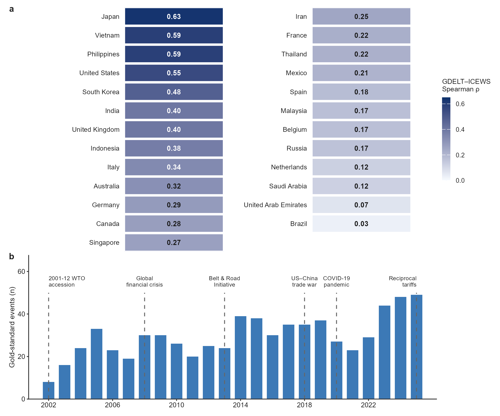
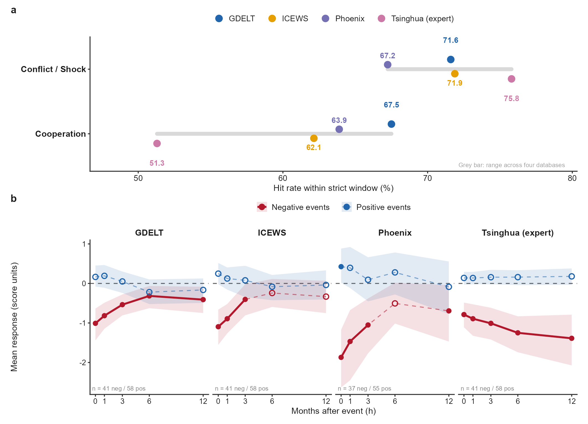

# Measurement validity in political event databases is audience-specific: evidence from China and its 25 trading partners

[](https://www.python.org/) [](https://www.r-project.org/) [](https://doi.org/10.5281/zenodo.21862534) [](LICENSE) [](docs/VERIFICATION.md)

> **Four databases. One bilateral relationship. Four different worlds.**

> **Six months. 9.66 million machine-coded events. 712 events hand-verified one by one.**
> We built what the event-data field has been calling for since 2015 — and used it to ask an uncomfortable question: *does your conclusion survive a change of database?*
> For China's bilateral relations, the answer is: **often not.**

### By the numbers

| | |
|---|---|
| 🔢 **9,659,113** | machine-coded events filtered to China × 25 partner dyads (GDELT + ICEWS + Phoenix) |
| 🥇 **712** | gold-standard bilateral events, each verified source-by-source, double-coded (Cohen's κ = 0.866) |
| 🌏 **25 × 23** | 25 trading partners × 23 years (2002–2025), monthly resolution |
| 📊 **6,685 + 170** | monthly trade panel + six-source public-opinion panel (Pew core: 17 countries × 13 waves) |
| ⚡ **30 seconds** | to independently recompute our headline numbers: `python verification/verify_headline_stats.py` |

### Why this is a first (as of August 2026)

- **To our knowledge, the first systematic cross-database validity audit of political-relations measurement.** Two generations of China–trade studies picked one measure and never stress-tested the choice. Prior comparisons stopped at conflict events (GDELT vs ICEWS; Ward et al. 2013) or methodology reviews (ACLED 2019). Nobody put four databases — three machine-coded, one expert-coded — up against a gold standard and followed the consequences all the way down to substantive conclusions.
- **The first source-verified, double-coded gold-standard event library for China's bilateral relations.** Schrodt (2015) wrote that the field needs but does not have open gold-standard cases with known inter-coder reliability. This repository is that missing infrastructure: 712 events, every one traceable to its sources.

### The old way vs. this audit

| | Prior practice | This audit |
|---|---|---|
| Measurement | Pick one database and run | Four databases, same-equation horse races |
| Validation | No gold standard | 712 events verified source-by-source |
| Robustness of conclusions | Not tested | Switching databases flips signs: Phoenix export β = **−0.0062** (p = 0.005) |
| Reproducibility | Data often unavailable | 1,064-file md5 manifest + byte-identical end-to-end reproduction |

## Key findings at a glance

| Finding | Numbers | So what |
|---|---|---|
| Cross-database agreement collapses along media density | GDELT–ICEWS Spearman ρ: **0.633** (China–Japan) vs **0.031** (China–Brazil), n = 207 | Correlation is not a database property — it is a coverage property |
| Divergence is structural, not noise | Machines capture behavior; experts judge intensity (gold-standard hit rates by event type) | The four databases are not measuring the same thing |
| Measurement choice changes conclusions | Same PPML-HDFE spec: only GDELT co-moves with trade (β = 0.0127, p = 0.026); Phoenix exports turn **negative** (−0.0062, p = 0.005) in the four-database equation | Your database choice *is* your result |
| The best database switches with the audience | Trade: GDELT wins. Public opinion: all four significant, **Phoenix** survives the horse race (β = 0.090, p = 0.002) | Validity is audience-specific — match the database to the question |

**Evidence base**: 9.66 million machine-coded events + **712 hand-curated, source-verified gold-standard events** (inter-coder Cohen's κ = 0.866) + monthly panel of China × 25 trading partners, 2002–2025 (n = 6,685) + six independent polling sources (Pew core: 17 countries × 13 waves).



*Figure 1. GDELT–ICEWS monthly-index correlations across 25 bilateral relationships (heatmap, ranked) and the annual distribution of the 712 gold-standard events (bars).*



*Figure 2. Gold-standard hit rates by event type (a) and event-window responses to negative vs positive events (b).*

## Why this repository is trustworthy

- ⚡ **30-second self-check**: clone and run `python verification/verify_headline_stats.py` — headline statistics recomputed independently, PASS/FAIL printed. No configuration needed.

Every number in the paper was re-derived from this repository before release (see [`docs/VERIFICATION.md`](docs/VERIFICATION.md)):

- ✅ **End-to-end Python reproduction**: the aggregation script re-run on the 2.36 GB raw retrieval CSV reproduces the released monthly scores **byte-identical** (md5-matched)
- ✅ **End-to-end R reproduction**: Figure 2 re-generated from package files alone, all built-in QA gates passed (hit rates 67.5 / 51.3 / 75.8; Phoenix IRF −1.87 / +0.43)
- ✅ **Headline statistics recomputed** from released scores: 0.633 / 0.031 (n = 207) reproduced exactly
- ✅ Full-file **md5 manifest** + row-count assertions (panel n = 6,685; events = 712; …)

## The audit in one paragraph

Three layers, one question. *Consistency*: do the databases agree with each other (pairwise correlations, directional agreement, five aggregation algorithms)? *Validity*: do they capture what experts say happened (712-event gold standard, hit rates by type and window)? *Consequences*: does the choice change the answer (same-equation PPML-HDFE horse races on trade and public opinion, local projections h = 0–6, event studies with 1,000× permutation falsification)?

## Pipeline

```
Raw acquisition (GDELT zips / ICEWS Dataverse / Phoenix package / Tsinghua PDF / IMF / WTO / 6 polling sources)
  → dyad retrieval (China × 25 partners, strict actor-country matching)
  → day-to-month aggregation (geometric mean in log space, +11 shift, two-stage)
  → panel assembly (trade + scores + GDP + FX + FTA)
  → estimation (PPML-HDFE, Local Projections h=0–6, event studies, 1,000× permutation falsification)
  → audit reporting (three layers: consistency, validity, causal inference)
```

See [`docs/PIPELINE.md`](docs/PIPELINE.md) for the full lineage map and [`docs/SCRIPT_LINEAGE.md`](docs/SCRIPT_LINEAGE.md) for the versioned script inventory.

## Repository map

| Path | Contents |
|---|---|
| `code/01_acquisition/` | GDELT/ICEWS download & dyad-retrieval scripts (final versions) |
| `code/02_aggregation/` | Day-to-month aggregation lab (geometric-mean baseline + 4 alternatives) |
| `code/03_economic_data/` | IMF DOTS/QNEA/REER, Comtrade, WTO RTA, CEPII BACI scripts |
| `code/04_panel/` | Panel assembly + polling-data cleaning chain (Python + R) |
| `code/05_event_curation/` | Gold-standard event curation & source-verification scripts |
| `code/06_analysis/` | PPML suite, event-study suite (9 modules), 17 revision tests, fair-coverage rerun with comparison ledger |
| `code/07_figures/` | All figure scripts (R, ggplot2) |
| `data/core/` | The release datasets (fair-coverage scores ×4 DBs, panel, 712 events + gold-standard, Pew panel, versions/leaders/auxiliary) |
| `data/appendix_tables/` | 33 CSVs backing every table in paper & SI |
| `figures/` | All manuscript figures (300 dpi) |

Raw event data (3.5 GB: GDELT/ICEWS retrievals, Phoenix source package) and the full unabridged package are archived separately on Zenodo: **[doi:10.5281/zenodo.21862534](https://doi.org/10.5281/zenodo.21862534)**. Source databases are public: GDELT Project, ICEWS (doi:10.7910/DVN/28075), Phoenix (doi:10.13012/B2IDB-0647142_V3).

## Reproduce

```bash
pip install -r requirements.txt        # Python deps; R deps in code/R_packages.txt
python verification/verify_headline_stats.py   # 30 秒自证：头条数字独立重算，打印 PASS/FAIL
Rscript code/07_figures/figures_R/fig02_v3.R   # 图 2 再生成（内置 QA 闸门）
```

Scripts carry the author's machine paths; redirect to this repo's folders as documented in `docs/PIPELINE.md`.

**Don't take our word for it — clone and run the 30-second check.**

## Citation

See `CITATION.cff`. If you use the 712-event gold standard or the audit framework, please cite the manuscript (preprint available from the authors).

## License

Code: MIT (see [LICENSE](LICENSE)). Data (derived indices, gold-standard events, appendix tables): CC-BY 4.0 (see [LICENSE-DATA.md](LICENSE-DATA.md)). Source databases remain under their original publishers' terms.
